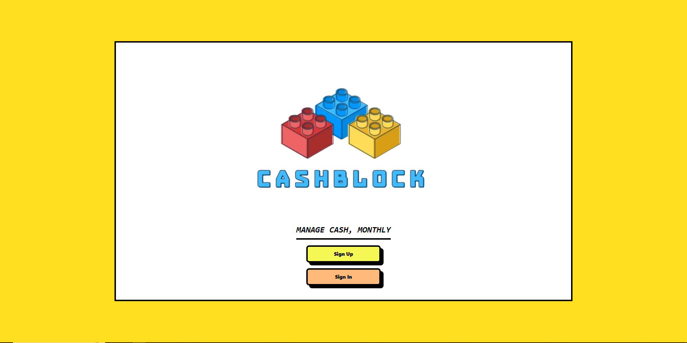
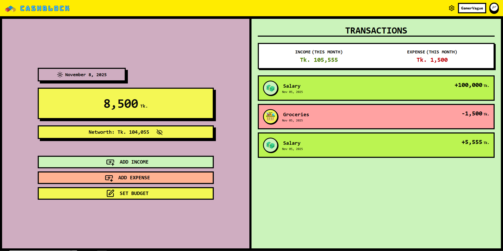
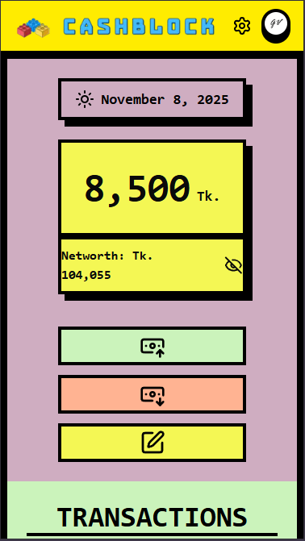
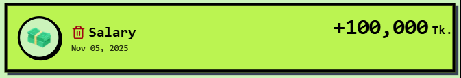

# CashBlock
## [Check the website](cash-block.vercel.app)

**Manage your cash. Monthly.**

---

## Table of Contents

- [About](#about)
- [Features](#features)
- [Tech Stack](#tech-stack)
- [Getting Started](#getting-started)
- [Usage](#usage)
- [Contributing](#contributing)
- [License](#license)

---

## About

CashBlock is a **budget management app** designed to help users track their income and expenses with brutalist aesthetics and a no-nonsense interface.  
It emphasizes clarity, speed, and efficiency, allowing you to see your cash flow at a glance while keeping your focus sharp.

---

## Features

- Add, view, and delete transactions
- Track monthly income and expenses
- Category-based transaction management with icons
- Brutalist UI for maximum clarity
- Offline-ready Progressive Web App (PWA) support
- User authentication with Clerk

---

## Tech Stack

- **Frontend:** Next.js 16 (App Router), React 18, TailwindCSS
- **Backend:** Next.js API Routes, Prisma ORM
- **Database:** PostgreSQL (via Prisma)
- **Authentication:** Clerk
- **PWA:** Manifest + Service Worker
- **Fonts:** Geist, Geist Mono

---
